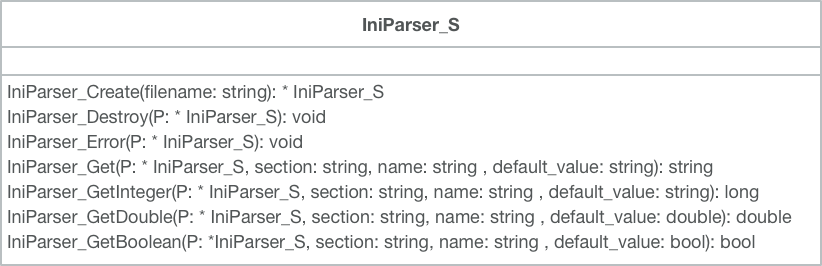

# C-INI-Parser

[](https://travis-ci.org/taka-wang/c-ini-parser)
[](https://raw.githubusercontent.com/taka-wang/c-ini-parser/master/LICENSE)

An simple INI parser based on [inih](https://github.com/benhoyt/inih) in C.
You only need to include the ini_parser.h header and link with ini.c and ini_parser.c

## Class Diagram




## C API

```c

// constructor
IniParser_T IniParser_Create(const char* const filename);

// destructor
void IniParser_Destroy(IniParser_T P);

// check error
int IniParser_CheckError(IniParser_T P);

// get string via key string
const char* const IniParser_Get(IniParser_T P, const char* const section, const char* const name, const char* const default_value);

// get integer via key string
long IniParser_GetInteger(IniParser_T P, const char* const section, const char* const name, long default_value);

// get real(double) via key string
double IniParser_GetDouble(IniParser_T P, const char* const section, const char* const name, double default_value);

// get boolean via key string
bool IniParser_GetBoolean(IniParser_T P, const char* const section, const char* const name, bool default_value);
```

## Example

Build from example folder (link ini_parser.c and ini.c)

```bash
gcc -std=c99 -Wall -o test test.c ../src/ini_parser.c ../src/internal/ini.c
```


Sample INI taken from inih repo

```bash
; Just comments
; Another comments

[protocol]             ; Protocol configuration
version=6              ; IPv6


[user]
name = Bob Smith       ; Spaces around '=' are stripped
email = bob@smith.com  ; And comments (like this) ignored
active = true          ; Test a boolean
pi = 3.14159           ; Test a floating point number
```

Sample Code

```c
#include <stdio.h>
#include <stdlib.h>
#include <string.h>

#include "../src/ini_parser.h"

int main()
{
    IniParser_T p = IniParser_Create("test.ini");
    printf("Is errort: %d\n", IniParser_CheckError(p));

    const char * v1 = IniParser_Get(p, "user", "name", "taka");
    printf("user-name: %s\n", v1);

    long v2 = IniParser_GetInteger(p, "protocol", "version", 4);
    printf("protocol-version: %ld\n", v2);

    double v3 = IniParser_GetDouble(p, "user", "pi", 10.2);
    printf("user-pi: %f\n", v3);

    bool v4 = IniParser_GetBoolean(p, "user", "active", false);
    printf("user-active: %d\n", v4);

    IniParser_Destroy(p);

    return 0;
}
```

---

## Dependency

- [inih](https://github.com/benhoyt/inih): Simple .INI file parser in C
- [uthash](https://github.com/troydhanson/uthash): C macros for hash tables

## TODO

- CMake
- Unit Test

## License

BSD

## Acknowledgments

The design of this library was inspired by [inih](https://github.com/benhoyt/inih) and [libzdb](https://github.com/taka-wang/libzdb).